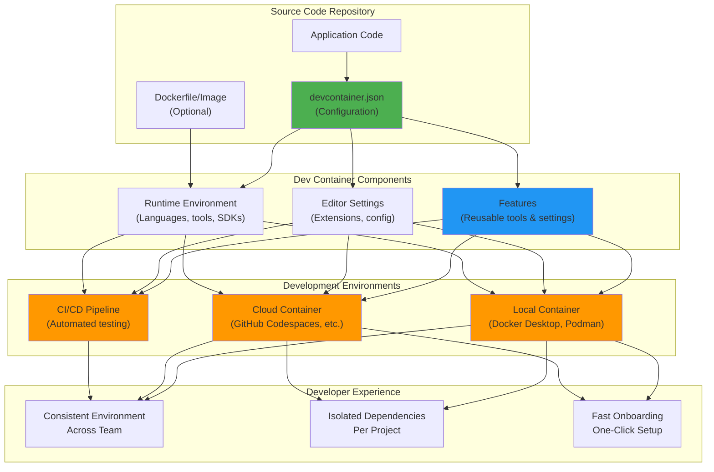

# Development Containers Website

This repo holds the website for the [Development Containers Specification](https://github.com/devcontainers/spec).

You may view the site at [containers.dev](https://containers.dev).

## What are Development Containers?

*A development container allows you to use a container as a full-featured development environment, with consistent tooling across local, cloud, and CI/CD environments.*

## Building

If you'd like to build and preview the site yourself, we make it as smooth as possible through a dev container in this repo!

### Dev container

You may build GitHub Pages sites with [Jekyll](https://jekyllrb.com/), which is a Ruby gem. You could manually install these tools on your machine, or you can easily get started with the setup you already need through a dev container!

You may review this repo's dev container in the [`.devcontainer`](https://github.com/devcontainers/containers.dev/tree/gh-pages/.devcontainer) folder.

It is from this [Jekyll Dev Container Template](https://github.com/devcontainers/templates/tree/main/src/jekyll).

### Steps to build and run

* Clone or open this repo in the dev container-supporting editor of your choosing.
     * You may review supporting tools and services [here](https://containers.dev/supporting).
* Reopen this repo in the dev container, so that the container builds and you may develop inside it using the included tools. 
* Once the dev container finishes building, execute the following command in your dev container to start the site: `bundle exec jekyll serve`
* Check out the site! http://localhost:4000/containers.dev/

## Feedback and contributing

If you'd like to provide feedback on or contribute to the dev containers website, please feel free to open an issue or PR in this repo.

For issues on and contributions to the dev container specification itself, please visit the [Dev Containers Spec repo](https://github.com/devcontainers/spec).

## License

License for this repository: https://github.com/devcontainers/containers.dev/blob/gh-pages/LICENSE.
